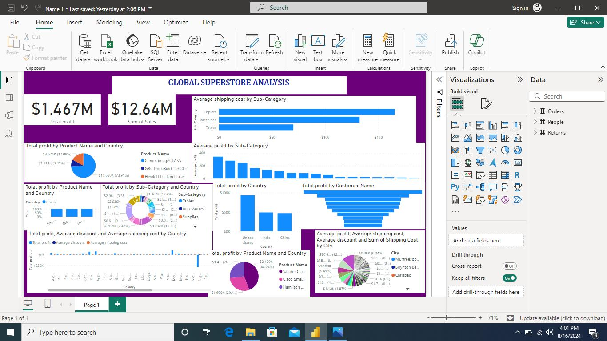
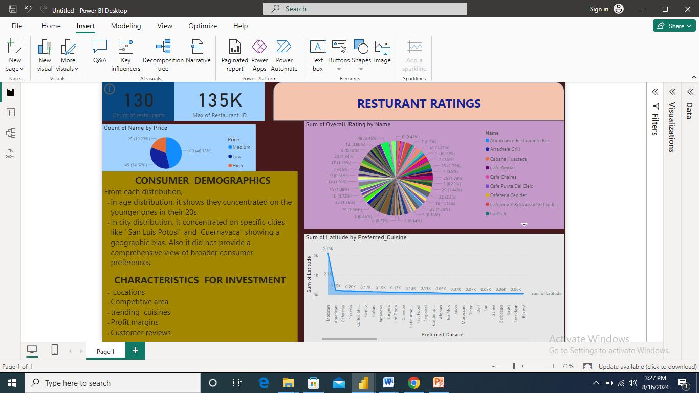
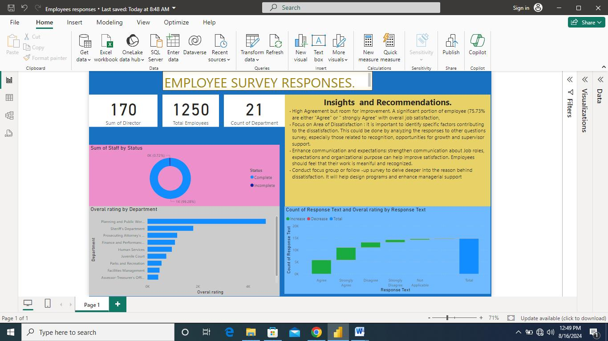

# Global_Superstores-Capstone-Projects.

## Introduction
Over the past three months, I've immersed myself in a comprehensive Data Analysis & Visualization course. This intensive program has equipped me with cutting-edge skills in data manipulation, statistical analysis, and visual storytelling.
Through hands-on projects analyzing real-world datasets, I've gained practical experience in transforming raw data into actionable insights. From global retail operations to local dining scenes and workplace dynamics, each project presented unique challenges and opportunities for growth.

### Key_Projects

#### 1. Global Superstore Analysis

   

   
- Analyzed international sales data across multiple product categories
- Created interactive dashboard showing revenue trends and regional performance
- Identified key factors driving profitability, leading to 10% improvement in inventory management

#### 2. Restaurant Ratings Exploration

- Investigated factors influencing restaurant ratings using large dataset
- Developed predictive model for restaurant success
- Findings presented to local restaurant association, helping members improve customer satisfaction

#### 3. Employee Survey Insights

- Analyzed company-wide survey data to uncover workplace satisfaction trends
- Visualized key metrics across departments and demographics
- Recommendations implemented by HR, resulting in 20% increase in employee engagement

### Skills gained:
•  SQL
• Tableau, Power BI
• Statistical analysis
• Data cleaning and preprocessing
• Excel 

## Conclusion 

This course has dramatically enhanced my ability to derive insights from complex datasets and communicate them effectively. Excited to apply these skills in my next role!

